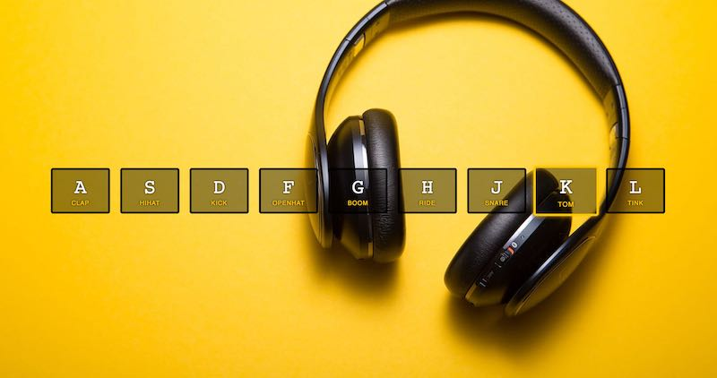

# #100DaysOfCode Log - Round 1 - Davida Pitts

The log of my #100DaysOfCode challenge. Started on November 19, Monday, 2018.

## Log

### R1D1
Started Wes Bos' [Javascript 30](https://javascript30.com/)  course. Built a drumkit with vanilla js. While building the drumkit, I realized my debugging skills are improving. That put a smile on my face.

### R1D2
